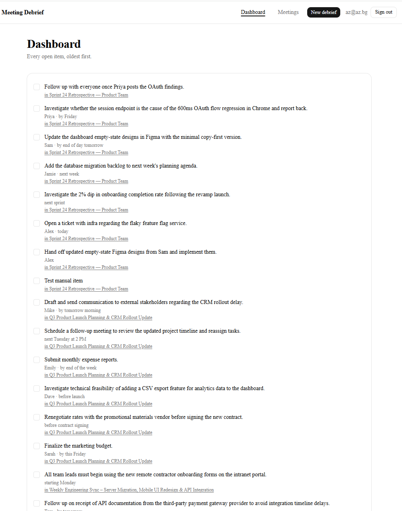
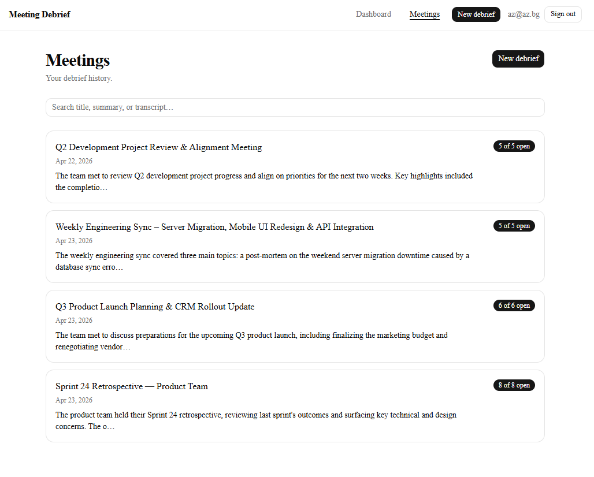
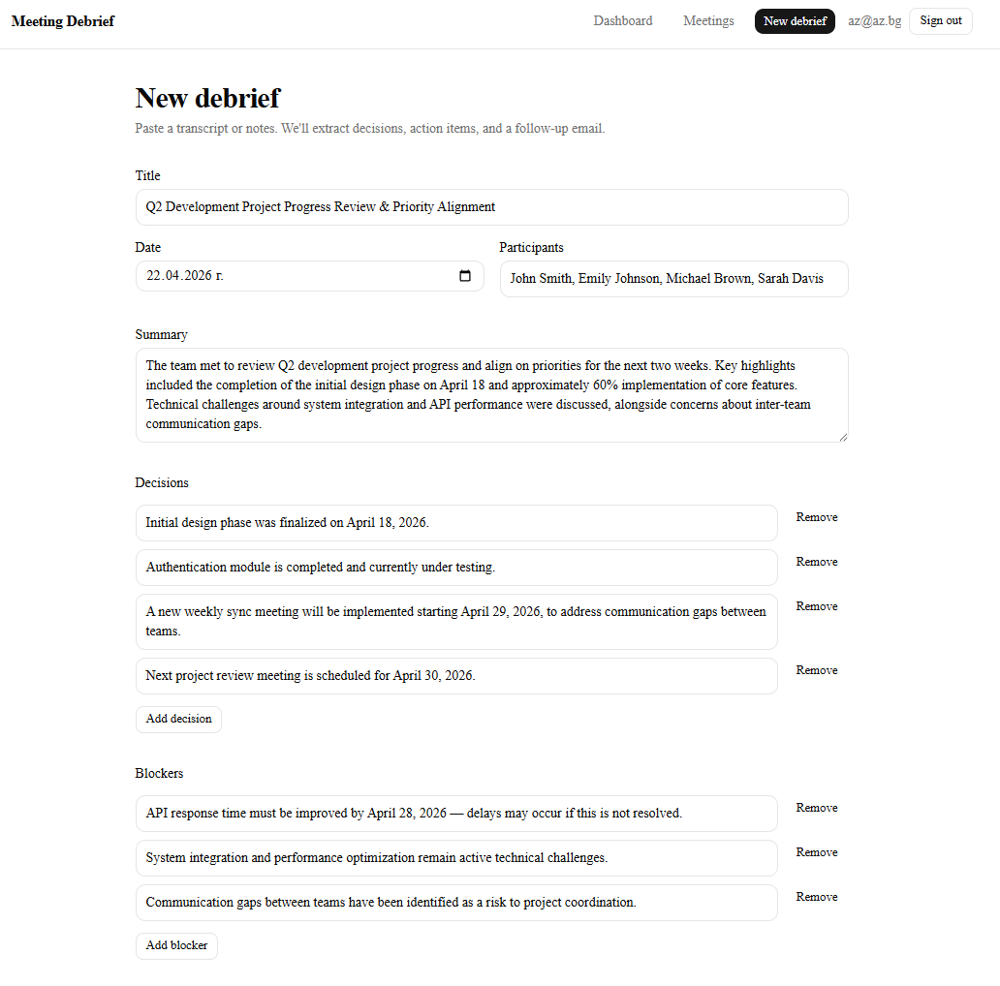
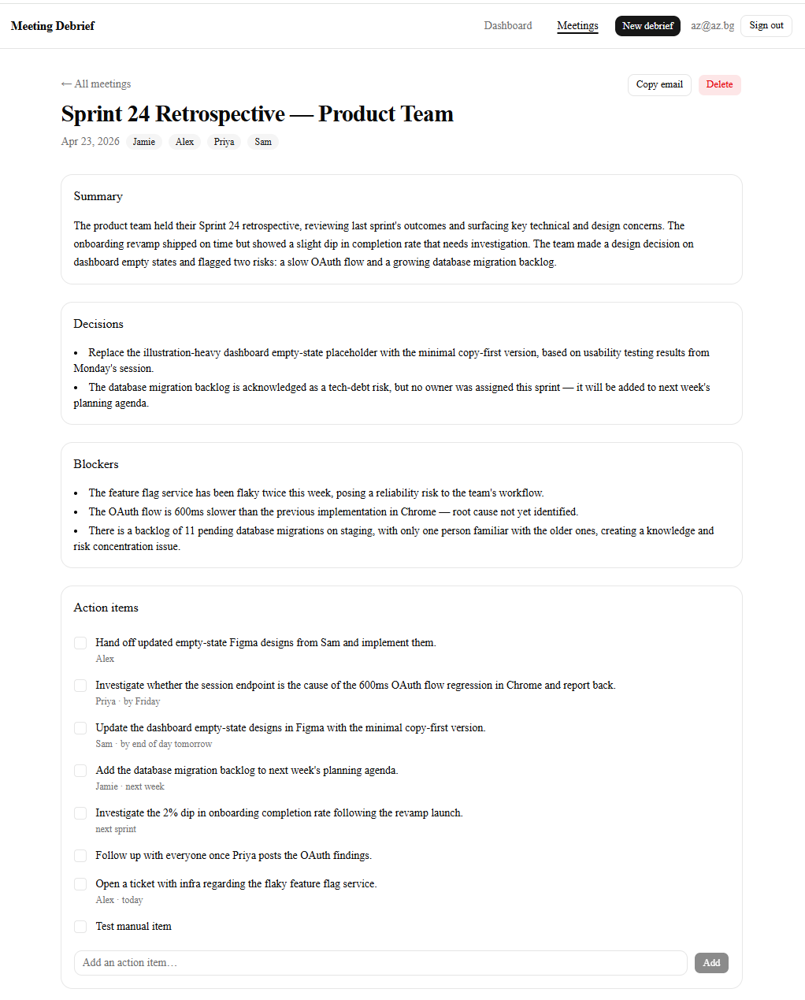

# Meeting Debrief

> Turn messy meeting transcripts into decisions, action items, and a ready-to-send follow-up email — and keep everything searchable.

[](https://nextjs.org)
[](https://www.typescriptlang.org)
[](https://supabase.com)
[](https://meeting-debrief.vercel.app)

Paste a transcript or rough notes. An AI extracts participants, decisions, action items, blockers, and a follow-up email — you review and edit before saving. Action items become checkboxes you tick off across a cross-meeting dashboard, so the commitments you made in Monday's retro don't get lost by Thursday. Everything is scoped to your account via Postgres Row Level Security.

**Live demo:** https://meeting-debrief.vercel.app

---

## Features

- **Paste and go** — a transcript or a quick braindump becomes structured output in seconds.
- **Review before you save** — the AI draft is always editable. Rename the title, drop action items that don't apply, rewrite the follow-up email.
- **Tick off action items across meetings** — a single dashboard shows every open commitment, oldest first, with a one-click link back to its source meeting.
- **Add items that the AI missed** — manual action items on any meeting, any time.
- **Search your history** — full-text search across title, summary, and transcript using Postgres tsvector + `websearch_to_tsquery`.
- **Copy the follow-up email** — one click puts the 120-180 word draft on your clipboard.
- **Friendly rejection** — if the input isn't a meeting, you get a clear message, not a broken result.
- **Signup without an inbox** — email confirmation is disabled so you can try it without waiting on delivery.

## Screenshots

<table>
  <tr>
    <td align="center">
      <a href="./img/dashboard.png">
        
      </a>
      <br>
      <sub><b>Dashboard</b></sub>
      <br>
      <sub>Open action items across all meetings</sub>
    </td>
    <td align="center">
      <a href="./img/meetings-list.png">
        
      </a>
      <br>
      <sub><b>Meetings list</b></sub>
      <br>
      <sub>History with search</sub>
    </td>
    <td align="center">
      <a href="./img/review-draft.png">
        
      </a>
      <br>
      <sub><b>AI review draft</b></sub>
      <br>
      <sub>Edit before saving</sub>
    </td>
    <td align="center">
      <a href="./img/meeting-detail.png">
        
      </a>
      <br>
      <sub><b>Meeting detail</b></sub>
      <br>
      <sub>Action items + transcript</sub>
    </td>
  </tr>
</table>

*Click any thumbnail to view full-size.*

## How it works

The debrief flow is a single paste → review → save loop. Claude Sonnet 4.6 is called via tool-use: two tools (`record_debrief`, `reject_input`) with `tool_choice: { type: "any" }` force the model to call exactly one, so there's no parsing ambiguity. Zod re-validates the result server-side before the save commits.

1. **Paste** a transcript or rough notes (≥ 40 characters).
2. **AI extraction** produces structured intelligence — participants, summary, decisions, blockers, action items with owners and due hints, and a first-person follow-up email (~150 words).
3. **Review & edit** — every field is editable. Add or remove action items, rewrite the summary, fix a misattributed owner.
4. **Save** — the meeting lands in your history, action items become tickable checkboxes, and the original transcript stays accessible via a collapsed accordion.

## Tech stack

| Category | Choice |
|---|---|
| Framework | Next.js 16 (App Router, React 19) |
| Language | TypeScript (strict) |
| Styling | Tailwind CSS 4, shadcn/ui (base-ui primitives), Lucide icons |
| Database | Supabase Postgres with Row Level Security |
| Auth | Supabase Auth via `@supabase/ssr` (cookie-bridged sessions) |
| AI model | Anthropic Claude Sonnet 4.6 (tool-use) |
| Search | Postgres `tsvector` with `websearch_to_tsquery` |
| Validation | Zod |
| Hosting | Vercel |
| Package manager | pnpm |

## Getting started

### Prerequisites

- Node.js ≥ 20
- pnpm ≥ 9
- A Supabase project (free tier is enough)
- An Anthropic API key (a single debrief costs roughly $0.01 at current Sonnet 4.6 pricing)

### 1. Clone and install

```bash
git clone https://github.com/bat-gogo/meeting-debrief.git
cd meeting-debrief
pnpm install
```

### 2. Set up Supabase

1. Create a new project at [supabase.com](https://supabase.com).
2. Apply the migrations in order — paste each file from [`database/`](./database) into Supabase Studio's SQL editor, or run `supabase db push` if you've linked the project with the Supabase CLI.
3. Disable email confirmation: **Authentication → Providers → Email → uncheck "Confirm email"**.
4. Copy your project URL and publishable anon key from **Settings → API**.

### 3. Configure environment

Copy the template:

```bash
cp .env.local.example .env.local
```

Fill in:

```
NEXT_PUBLIC_SUPABASE_URL=https://your-project.supabase.co
NEXT_PUBLIC_SUPABASE_ANON_KEY=sb_publishable_...
ANTHROPIC_API_KEY=sk-ant-...
```

### 4. Run

```bash
pnpm dev
```

Open [http://localhost:3000](http://localhost:3000).

## Architecture highlights

Three non-obvious decisions worth understanding — more detail in [`docs/ARCHITECTURE.md`](./docs/ARCHITECTURE.md).

**Row Level Security is the entire privacy model.** Every row has a `user_id` column, and RLS policies restrict all operations to `(select auth.uid()) = user_id`. The `meetings_with_stats` view uses `security_invoker = true` — without it, the view would bypass RLS and leak every user's data to every authenticated caller.

**Tool-use for structured AI output.** Instead of prompt-engineered JSON, the app defines two Anthropic tools — `record_debrief` for the happy path and `reject_input` for "not a meeting" detection — with `tool_choice: { type: "any" }` forcing the model to call exactly one. Zod re-validates the tool input server-side as belt-and-braces.

**Generated tsvector column for search.** `meetings.fts` is `GENERATED ALWAYS AS STORED`, so Postgres maintains it automatically on every insert and update. A GIN index on the column plus `.textSearch("fts", q, { type: "websearch" })` via Supabase JS maps directly to `websearch_to_tsquery('english', q)` — no triggers, no application-layer sync.

## Project structure

```
meeting-debrief/
├── src/
│   ├── app/
│   │   ├── (app)/           # Protected routes: dashboard, meetings, detail, new
│   │   ├── (auth)/          # Login / signup + auth server actions
│   │   ├── error.tsx        # Global error boundary
│   │   └── layout.tsx       # Root layout + Toaster mount
│   ├── components/          # UI components (most are client islands)
│   ├── lib/
│   │   ├── ai/              # Anthropic SDK wrapper + tool schemas + system prompt
│   │   ├── supabase/        # Server / client / middleware helpers
│   │   ├── database.types.ts # Supabase-generated types
│   │   └── schemas.ts       # Zod schemas + inferred TypeScript types
│   └── proxy.ts             # Auth cookie refresh + route gating (Next 16 convention)
├── database/                # Sequenced SQL migrations (see README there)
├── img/                     # Screenshots embedded in this README
├── docs/                    # Architecture & extended docs
├── process/                 # Workshop plan-mode artifacts (history — optional reading)
└── scripts/                 # Dev helpers
```

## Development notes

- `pnpm lint` — ESLint flat config
- `pnpm format` — Prettier with Tailwind plugin
- `pnpm format:check` — CI-friendly format verification
- `pnpm build` — must be clean before PR

To verify your Anthropic key + prompt work end-to-end, run the three-case harness:

```bash
pnpm dlx tsx --env-file=.env.local scripts/test-debrief.ts
```

It exercises a real transcript (expects `draft`), a too-short input (expects `rejected` client-side), and a non-meeting paragraph (expects `rejected` via the `reject_input` tool).

## License

MIT — see [LICENSE](./LICENSE).

## Acknowledgments

Built with [Anthropic Claude](https://claude.com), [Supabase](https://supabase.com), [Vercel](https://vercel.com), [Next.js](https://nextjs.org), and [shadcn/ui](https://ui.shadcn.com).

Originally created during the Encorp Vibe Coding workshop. Plan-mode and task-tracking artifacts from that process are preserved in [`process/`](./process) for anyone interested in how the build was structured.
